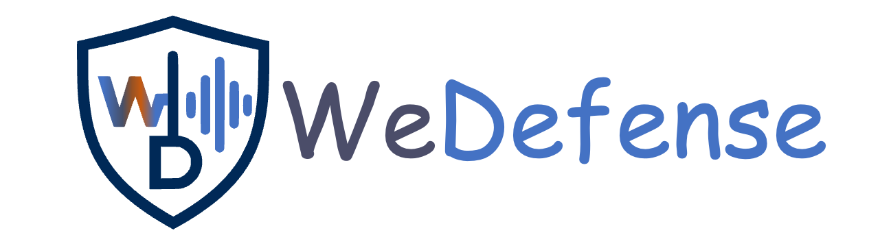

<p align="center">
  
</p>

| 📘 [Tutorials](#) | 📚 [Documentation](#) | 🤝 [Contributing](#) | 🤗 [Demos](https://huggingface.co/spaces/wedefense/fake_audio_detection_demo) |


>  ⚠️ **Warning / Disclaimer**⚠️
>
> Although the goal of this toolkit is to promote progress in fake detection, we acknowledge that any open-source software may be misused by malicious actors.
> **We strongly discourage any use of the models or code for harmful purposes**, such as:
>
> * Bypassing biometric authentication
> * Creating or enhancing systems that generate fake or deceptive audio
>
> Some of the models included here perform well on public datasets, but may not generalize to unseen or adversarial scenarios. Please be aware of these limitations and use this repository responsibly and ethically.

## 🛡️ What WeDefense Offers
WeDefense aims to be a relatively light-weight, modular, and extensible toolkit tailored to defend against fake audio. Currently we supported detection and uniform frame-level segmentation. If you are interested to contribute, please feel free to contact us! 
| Category | Supported ✅ | Planned ⏳ |
| --- | --- | --- |
| Databases | ASVspoof 5 (2024), PartialSpoof, ESDD1, | ASVspoof2019/2021, ADD22/23, ITW, ODSS, ShiftySpeech, MLAAD, SpoofCeleb, ReplayDF, DeePen, FoR, DFADD, AI4T, Deepfake-Eval-2024, SpeechFake, AV-Deepfake1M/++, HAD, Psynd, LAV-DF, LlamaPartialSpoof, PartialEdit |
| Augmentation | speed perturb, codec, raw boost, musan+rirs |  |
| Models for Detection | LCNN-LSTM, ResNet, SSL-gmlp, SSL-AASIST, SSL_MHFA, SSL-res1d, SSL-SLS, AASIST| ALLM4ADD |
| Models for Localization | SSL-MHFA, SSL-SLS, SSL-BAM | CFPRF, PET, AGO, GNCL, UMMAformer, W-TDL, BA-TFD(+), VIGO |

More details please refer to [support_status.md](https://github.com/zlin0/wedefense/blob/main/docs/source/support_status.md).


## 🌱 Environment
```bash
bash ./install_env.sh
conda activate wedefense
```

## 📝 How to use


## 🔥 News
* 2026.01.20: change the visibility to public
* 2025.06.04: submitted to ASRU


## 🚀 Vision and Contribution
WeDefense aims to support tasks beyond detecting fake audio but also support other relevant tasks to protect the audio.
<p align="center">
  
</p>


## 📝 Citations
If you find WeDefense useful, please cite it as:

```bibtex
@article{zhang2025wedefense,
  title={WeDefense: A Toolkit to Defend Against Fake Audio},
  author={Lin Zhang, Johan Rohdin, Xin Wang, Junyi Peng, Tianchi Liu, You Zhang, Hieu-Thi Luong, Shuai Wang, Chengdong Liang, Anna Silnova, Nicholas Evans},
  journal={arXiv preprint arXiv:},
  year={2025}
}
```